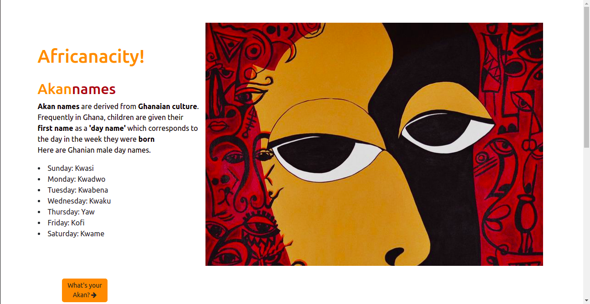
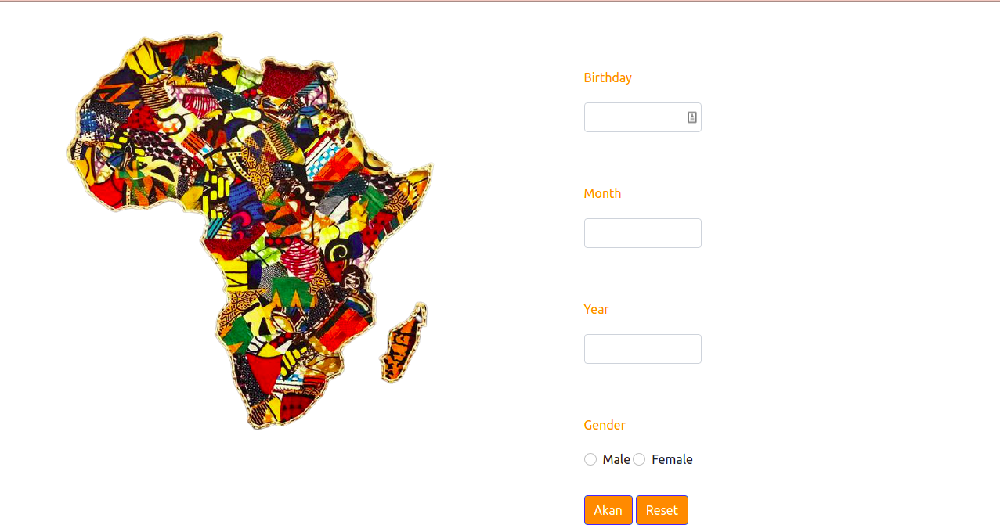

# AKAN_NAME GENERATOR
#### It's about an Akan name generator. A user inputs their birth date and a name is generated for them in Ghanaian culture.
#### By Laurette Mong'ina.
## Akan_Name
Akan name generator is a project based on Ghanaian culture. A user inputs their birthdate, and a name is generated for them depending on the day they were born. We have a landing page that has a short description on the akan naming system and then a form page where user inputs their date and selects gender. Below are the list of names
Male
<ul>
<li>Sunday: Kwasi</li>

<li>Monday: Kwadwo</li>

<li>Tuesday: Kwabena</li>

<li>Wednesday: Kwaku</li>

<li>Thursday:  Yaw</li>

<li>Friday: Kofi</li>

<li>Saturday: Kwame</li>
</ul>
Female
<ul>
<li>Sunday: Akosua</li>

<li>Monday: Aduowa</li>

<li>Tuesday: Abenaa</li>

<li>Wednesday: Akua</li>

<li>Thursday:  Yaa</li>

<li>Friday: Afua</li>

<li>Saturday: Ama</li>
</ul>

## Requirements
<ul>
<li>A code editor(vscode)</li>
<li>A github account</li>
<li>Internet.</li>
</ul>

## Setup/Installation
<ul>
<li>Clone this repository to your machine</li>
<li>Navigate to the top level of your directory.</li>
<li>Open the index.html in your browser</li>
</ul>
##BDD
<ul>
  <li>A form where a user inputs their birthday</li>
  <li>If the date is less than 0 or greater than 31, the form will not submit and will alert user of an error</li>
  <li>If the month is greater than 12 or less than 1, the user will be alerted of an error</li>
  <li>else if, after checking the gender and submitting the form, user is alerted of their Akan name and the day they were born. Afterwards, the form resets</li>
## Known Bugs
None. Website runs well.
## Technologies Used
I used HTML,CSS and Java Script to create this akan name generator. HTML for the structure and css for the styling. Javascript to validate the form and bootstrap for the grid system and button classes. I used vscode as my code editor and deployed on Github.
## Support and contact details
In case of any issues or you have question, concerns, ideas to implement and contributions, be sure to reach out to me via email (monginalaurette@gmail.com). Any contributions will be highly appreciated.Pull requests are highly welcome.
### License
[MIT].
Copyright (c) 2021 by Laurette Mong'ina.
